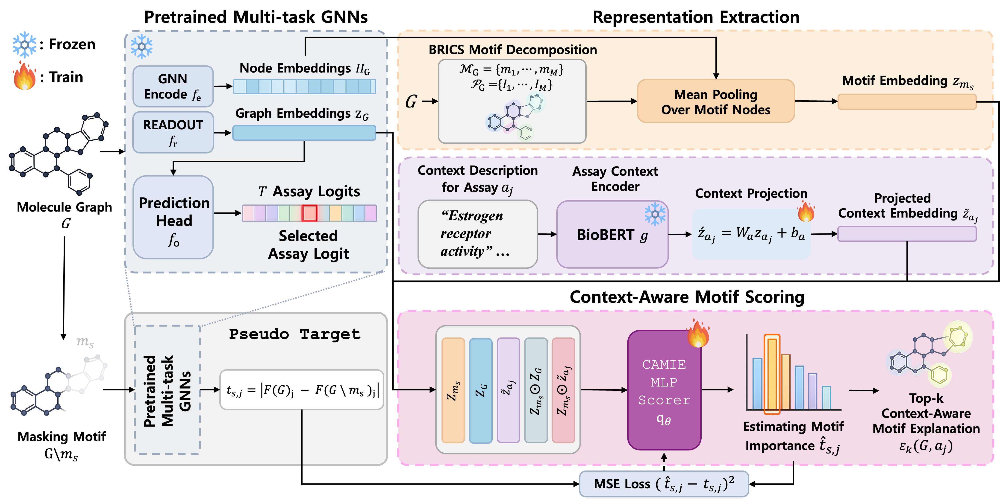

# CAMIE: Context-Aware Subgraph Explanations for Multi-Task GNNs

Welcome to the anonymous official implementation codebase for **CAMIE**, a post-hoc explanation framework for **multi-task molecular GNNs**.

Unlike context-agnostic explainers that assign a single fixed explanation to a molecule, CAMIE estimates **assay-specific motif importance** for each **molecule--assay pair**. The key idea is that, in multi-task molecular prediction, the same molecule may rely on different substructures depending on the queried biological assay. CAMIE captures this by conditioning motif scoring on assay context and distilling assay-specific motif-removal responses from a frozen multi-task predictor.

---

## Overview

CAMIE consists of four stages:

1. **Frozen multi-task prediction backbone**  
   A pretrained shared GNN encodes each molecule and produces assay-specific outputs.

2. **Motif decomposition and representation extraction**  
   Each molecule is decomposed into chemically meaningful candidate motifs using BRICS. Graph, motif, and assay-context representations are then constructed.

3. **Context-aware motif scoring**  
   CAMIE learns a shared scorer over `(graph, motif, assay)` tuples using pseudo targets derived from assay-specific motif-removal responses.

4. **Top-k motif explanation**  
   At inference time, CAMIE ranks motifs for a queried assay and returns the top-k motifs as the explanation.

> Replace the figure below with the main framework figure from the paper.

```text
<p align="center">

  

</p>
```

---

## Problem Setting

Let a pretrained multi-task GNN predictor be

\[
F(G) \in \mathbb{R}^T,
\]

where \(G\) is a molecular graph and \(T\) is the number of assays/tasks.

For a motif \(m_s\) and assay \(a_j\), CAMIE defines the assay-specific pseudo target as

\[
t_{s,j} = \left|F(G)_j - F(G \setminus m_s)_j\right|,
\]

where \(G \setminus m_s\) denotes the perturbed graph obtained by masking the motif.

CAMIE then trains a context-aware scorer

\[
q(G, m_s, a_j; \theta)
\]

to estimate this assay-specific motif-removal response. The final explanation is obtained by ranking motifs according to their predicted scores and selecting the top-k motifs.

---

## Main Contributions

- **Context-aware explanation for multi-task GNNs**  
  CAMIE explains predictions at the level of a **molecule--assay pair**, rather than the molecule alone.

- **Knowledge-distillation-inspired pseudo supervision**  
  CAMIE uses the frozen backbone model's motif-removal response differences as pseudo targets, without retraining the backbone.

- **Shared assay-conditioned motif scorer**  
  CAMIE learns a single scorer shared across assays, enabling **cross-assay transfer** and better behavior in **low-resource assays**.

- **Faithfulness-oriented evaluation**  
  CAMIE is evaluated primarily with **S2-based Fidelity F1**, together with additional analyses on low-resource behavior, task similarity alignment, model-intrinsic shift, local evidence, and ablations.

---

## Repository Structure

```directory
CAMIE/
├── baselines/                  # Saliency and aggregation baseline models
│   ├── common/                 # Shared utilities, aggregation and metrics
│   └── models/
│       └── gradient/           # Gradient-based saliency (SA) baseline
├── datasets/                   # Preprocessing and dataset classes
│   ├── preprocess_toxcast.py   # Maps biological context and annotations to ToxCast
│   ├── toxcast_dataset.py      # Preprocesses and splits ToxCast deepchem dataset
│   ├── toxcast_graph_dataset.py# PyG InMemoryDataset definition for ToxCast
│   └── utils.py                # Graph helper functions
├── evaluate/                   # Evaluation scripts
│   └── compute_fidelity_f1_single.py # Computes F1-Fidelity under S1/S2 masking
├── models/
│   └── gnn/                    # Backbone GNN definitions and extraction script
│       ├── gnn.py              # PyG GIN/GCN architectures
│       ├── run_toxcast.py      # GNN backbone training & evaluation
│       └── extract_toxcast_emb.py # Extracts GNN graph and node embeddings
├── subgraph/                   # Subgraph & context processing
│   ├── context/
│   │   └── hierarchical_dataset.py # Generates motif-assay tables
│   ├── motifs/
│   │   ├── extract.py          # Decomposes SMILES into motifs (BRICS/Tree)
│   │   └── build_motif_emb.py  # Builds motif embeddings via node pooling
│   └── scoring/                # Joint Scorer implementation
│       ├── scoring_dataset.py  # Prepares pseudo-targets (masking difference)
│       ├── train_mse.py        # Trains the JointMLPScorer model
│       ├── scores_mse.py       # Predicts motif joint scores
│       └── decomposition_mse.py# Hard S1/S2 partition of motifs
├── utils/
│   ├── chemutils.py            # RDKit decomposition helpers
│   └── utils.py                # Generic utilities
│
├──
└── environment.yml             # Conda environment configuration
```

---

## Environment Setup

Create the conda environment from `environment.yml`:

```bash
conda env create -f environment.yml
conda activate SCAR
```

If your environment name is different, replace `SCAR` with the actual name defined in `environment.yml`.

---

## Dataset

We use the **ToxCast multi-task molecular assay benchmark**.

### Main statistics

- **# molecules**: 8,578
- **# assays/tasks**: 30
- **# observed molecule--assay pairs**: 59,131
- **# motif--assay scoring instances**: 413,114

### Split statistics

- **train pairs**: 49,110
- **valid pairs**: 4,681
- **test pairs**: 5,340

- **train molecules**: 6,862
- **valid molecules**: 858
- **test molecules**: 858

### Additional statistics

- **overall positive ratio**: 0.116
- **pairs per assay (min / median / max)**: 97 / 502 / 7,934
- **assays per molecule (min / median / max)**: 1 / 3 / 30
- **avg. motifs per molecule--assay pair**: 6.99
- **avg. motifs per molecule**: 7.61

We use **Bemis--Murcko scaffold splitting** with a **7:1:2** ratio and **BRICS** motif decomposition.

---

## Backbone Predictor

All CAMIE explanations are built on top of a **frozen pretrained multi-task molecular GNN**.

### Backbone configuration

- **GNN type**: GIN
- **# layers**: 5
- **hidden dimension**: 300
- **dropout**: 0.5
- **graph pooling**: mean

The backbone outputs assay-specific logits for all tasks, and CAMIE uses these outputs to construct pseudo targets.

---

## CAMIE Scorer

### Assay context

- **assay encoder**: BioBERT
- **context embedding dimension**: 768

### Training target

CAMIE uses:

- `pseudo_target_logit_diff`

as the default pseudo supervision target.

### Training configuration

- **optimizer**: Adam
- **learning rate**: 1e-3
- **weight decay**: 1e-5
- **batch size**: 512
- **epochs**: 50
- **split mode**: all
- **random seeds**: 0--9

### Joint MLP scorer

- **hidden dimension**: 256
- **# layers**: 3
- **dropout**: 0.2

### Explanation setting

- **top-k motifs**: 2 (main result)
- **fidelity threshold**: 0.5

For sensitivity analysis, we additionally evaluate:

\[
k \in \{1,2,3,4,5\}.
\]

---

## Baselines

We compare CAMIE against representative post-hoc explanation baselines.

### Optimization-based
- **eXEL-group**
- **eXEL-lasso**

### Gradient-based
- **SA**
- **GBP**
- **GradCAM**

### Perturbation-based
- **GNNExplainer**
- **PGExplainer**

> GraphMask and SubgraphX can be added here if/when their implementations are finalized in this repository.

For gradient- and perturbation-based baselines, node- or edge-level scores are converted to motif-level scores using a shared aggregation protocol.

---

## Main Evaluation Metric

### S2-based Fidelity F1

For a molecule--assay pair, CAMIE selects the top-k motifs as the explanation set \(S_2\). The remaining motifs are denoted by \(S_1\).

We evaluate explanation quality primarily by **S2-based Fidelity F1**:

- mask the selected motifs \(S_2\)
- recompute predictions
- binarize probabilities using **threshold = 0.5**
- measure the resulting **F1 drop**

A larger S2-based Fidelity F1 indicates that the selected motifs are more necessary for the assay-specific prediction.

---

## Main Experiments

The project includes the following experimental components.

1. **Main result: Fidelity F1**  
   Main comparison across CAMIE and post-hoc baselines using S2-based Fidelity F1.

2. **Low-resource analysis**  
   Assay-level analysis under low-resource settings.

3. **Task similarity alignment**  
   Relationship between assay similarity and explanation similarity.

4. **Model-intrinsic shift vs. fidelity**  
   Analysis of whether assay-specific explanation shift is coupled with improved fidelity.

5. **Local evidence examples**  
   Qualitative comparison of motif selection across assays for the same molecule.

6. **Ablation study**  
   - `ctx` vs. `graph` vs. `joint_mlp`
   - `joint_linear` vs. `joint_mlp`
   - `concat_mlp` vs. `joint_mlp`

---

## Execution Pipeline

### Step 1. Train the CAMIE scorer

```bash
python -m subgraph.scoring.train_mse \
  --scoring_table_dir assets/scoring/scoring_dataset/motif_context_scoring_table_seed0.csv \
  --out_dir assets/scoring/joint_mlp/seed0/joint_ckpt \
  --model_type joint_mlp \
  --seed 0
```

### Step 2. Score motif--assay tuples

```bash
python -m subgraph.scoring.scores_mse \
  --scoring_table_dir assets/scoring/scoring_dataset/motif_context_scoring_table_seed0.csv \
  --joint_ckpt_dir assets/scoring/joint_mlp/seed0/joint_ckpt \
  --out_dir assets/scoring/joint_mlp/seed0/scores \
  --model_type joint_mlp \
  --seed 0
```

### Step 3. Decompose into top-k motifs

```bash
python -m subgraph.scoring.decomposition_mse \
  --scored_table_dir assets/scoring/joint_mlp/seed0/scores/scored_table_joint_mlp_seed0.csv \
  --score_col score_joint_mlp \
  --rule_name joint_mlp \
  --out_dir assets/scoring/joint_mlp/seed0/decomposition \
  --seed 0
```

### Step 4. Compute Fidelity F1

```bash
python -m baselines.evaluate.compute_fidelity_f1_single \
  --decomp_csv assets/scoring/decomposition/ablation/mse/motif_decomposition_table_seed0.csv \
  --out_dir assets/baselines/fidelity_f1_single/seed0/mse \
  --model mse \
  --seed 0
```

> **Canonical MSE decomposition CSV**  
> Going forward, the canonical MSE decomposition file is:
>
> `assets/scoring/decomposition/ablation/mse/motif_decomposition_table_seed0.csv`
>
> The newer seed-specific path under `assets/scoring/mse/...` is used only for runtime-related summaries and should not be treated as the main decomposition source.

---

## Main Outputs

### Scored motif table
```text
assets/scoring/joint_mlp/seed0/scores/scored_table_joint_mlp_seed0.csv
```

### Motif decomposition table
```text
assets/scoring/decomposition/ablation/mse/motif_decomposition_table_seed0.csv
```

### Fidelity summaries
```text
assets/baselines/fidelity_f1_single/seed0/mse/compact_fidelity_f1_summary_mse.csv
```

---

## Reproducibility Notes

- All main results are reported over **10 random seeds (0--9)**.
- Main comparisons use **top-k = 2**.
- Probabilities are thresholded at **0.5** for F1-based fidelity evaluation.
- Gradient- and perturbation-based baselines use the same frozen multi-task GNN backbone.

---

## Notes

- CAMIE is a **post-hoc** explainer and does **not** retrain the original multi-task predictor.
- The pseudo target is derived from the predictor's assay-specific motif-removal response, so CAMIE explanations depend on the behavior of the frozen backbone.
- Explanation resolution is limited by the predefined motif candidates produced by BRICS decomposition.
